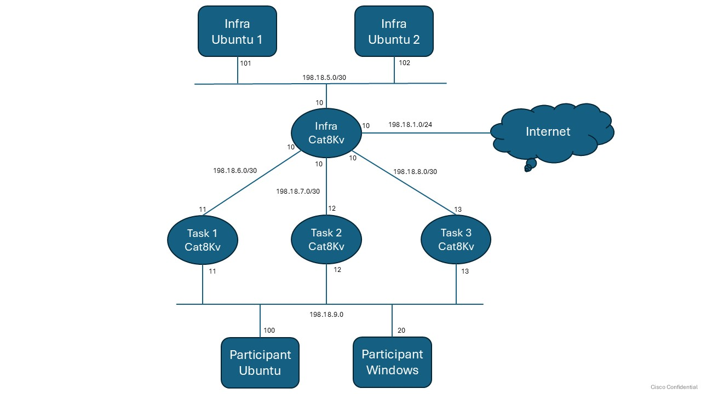

# LTRCLD-1199 – Using Containers on Cisco Edge Devices to Turbocharge Troubleshooting

Welcome to **LTRCLD-1199**, a hands-on lab for deploying and operating containerized troubleshooting tools on **Cisco IOS-XE (Catalyst 8000v / C8Kv)** using:

- Native **App-Hosting**
- **Terraform** (Infrastructure as Code)
- **Kubernetes** (KIND + virtual kubelet)

---

## Index

### Lab Overview
- [Lab Objectives](#lab-objectives)
- [Prerequisites](#prerequisites)
- [Lab Topology](#lab-topology)
- [Device Access (SSH + RDP)](#device-access-ssh--rdp)

### Lab Tasks
- **Task 1**: [App-Hosting Deployment on IOS-XE (Manual)](task-1.md)
- **Task 2**: [App-Hosting Automation with Terraform](task-2.md)
- **Task 3**: [Kubernetes-Based Container Orchestration](task-3.md)
- **Task 4**: [Basic Network Validation (fping, dig, nmap)](task-4-basic.md)
- **Task 5**: [MTR Path Analysis (My Traceroute)](task-5-mtr.md)
- **Task 6**: [Web Testing & Troubleshooting (curl, wget, httpie)](task-6-web-ts.md)
- **Task 7**: [socat Practical Use Cases](task-7-socat.md)
- **Task 8**: [kcat (Kafka CAT) Connectivity & Message Flow](task-8-kcat.md)
- **Task 9**: [MRTG Interface Monitoring](task-9-mrtg.md)
- **Task 10**: [iPerf3 Network Performance Testing](task-10-iperf3.md)
- **Task 11**: [Wireshark Live Packet Capture (ERSPAN)](task-11-wireshark.md)

---

## Lab Objectives

By the end of this lab, you will be able to:

- Deploy a containerized tool on C8Kv using App-Hosting
- Use SCP and MD5 verification to safely transfer images
- Automate app-hosting configuration with Terraform
- Integrate C8Kv into a Kubernetes environment using KIND and virtual kubelet
- Validate that tools are running and accessible for troubleshooting work

---

## Prerequisites

To get the most value from this lab, you should be familiar with:

- Basic IOS-XE CLI navigation
- Fundamentals of Docker containers
- Basic understanding of Terraform and/or YAML
- Very basic Kubernetes concepts (Pods, Nodes) — helpful but not required

---

## Lab Topology

---

## Device Access (SSH + RDP)

Use the following information to access the lab devices.

| Name          | IP           | Username       | Password   |
|--------------|--------------|----------------|------------|
| Lab Ubuntu   | 198.18.1.100  | root           | C1sco12345 |
| cat8Kv-task-1| 198.18.1.11   | admin          | C1sco12345 |
| cat8Kv-task-2| 198.18.2.12   | admin          | C1sco12345 |
| cat8Kv-task-3| 198.18.2.13   | admin          | C1sco12345 |
| Lab Windows  | 198.18.1.20   | administrator  | C1sco12345 |

---
