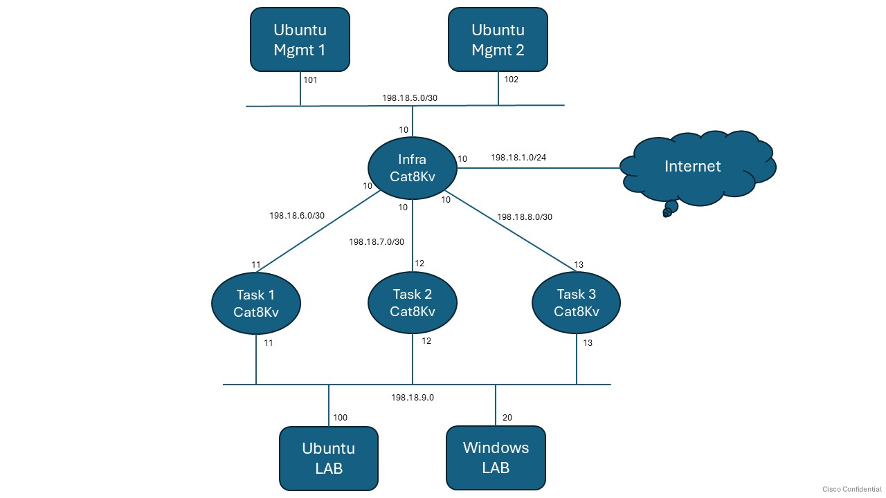

# LTRCLD-1199 – Using Containers on Cisco Edge Devices to Turbocharge Troubleshooting

Welcome to **LTRCLD-1199**, a hands-on lab for deploying and operating containerized troubleshooting tools on **Cisco IOS-XE (Catalyst 8000v / C8Kv)** using:

- Native **App-Hosting**
- **Terraform** (Infrastructure as Code)
- **Kubernetes** (kind + Virtual Kubelet)

---

### Lab Overview
- [Lab Objectives](#lab-objectives)
- [Prerequisites](#prerequisites)
- [Lab Topology](#lab-topology)
- [Device Access (SSH + RDP)](#device-access-ssh--rdp)
- [Container Details](containers.md)

### Lab Tasks
- **Task 1**: [App-Hosting Manual Deployment on IOS-XE](tasks/task-1.md)
- **Task 2**: [App-Hosting Automated Deployment with Terraform](tasks/task-2.md)
- **Task 3**: [Kubernetes App-Hosting using Virtual Kubelet](tasks/task-3.md)
- **Task 4**: [Network Validation (fping, dig, nmap)](tasks/task-4-basic.md)
- **Task 5**: [MTR Path Analysis](tasks/task-5-mtr.md)
- **Task 6**: [Web Testing & Troubleshooting](tasks/task-6-web-ts.md)
- **Task 7**: [socat (SOcket CAT) Practical Use Cases](tasks/task-7-socat.md)
- **Task 8**: [kcat (Kafka CAT) Connectivity & Message Flow](tasks/task-8-kcat.md)
- **Task 9**: [MRTG Interface Monitoring](tasks/task-9-mrtg.md)
- **Task 10**: [iPerf3 Network Performance Testing](tasks/task-10-iperf3.md)
- **Task 11**: [Wireshark Live Packet Capture](tasks/task-11-wireshark.md)
- **Task 12**: [Telegraf Monitoring with Prometheus Exporter](tasks/task-12-telegraf.md)
- **Task 13**: [Deploy multiple hello-app using Virtual Kubelet](tasks/task-13-kubernetes.md)
- **Task 14**: [Passwordless Access using SSH Keys](tasks/task-14-ssh-keys.md)
---

## Lab Objectives

By the end of this lab, you will be able to:

- Deploy a containerized tool on C8Kv using App-Hosting via CLI
- Automate App-Hosting configuration with Terraform
- Integrate C8Kv into a Kubernetes environment using [kind](https://kind.sigs.k8s.io/) and [Virtual Kubelet](https://virtual-kubelet.io/)
- Validate that tools are running and accessible for troubleshooting work

---

## Prerequisites

To get the most value from this lab, you should be familiar with:

- Basic IOS-XE CLI navigation
- Fundamentals of Docker containers
- Basic understanding of Terraform and/or YAML
- Very basic Kubernetes concepts (Pods, Nodes) — helpful but not required

---

## Lab Topology

Participants do not need access to the `Ubuntu Mgmt` 1, `Ubuntu Mgmt 2` and `Infra Cat8Kv` to execute this lab.

---

## Device Access Out of Band (SSH + RDP)

Use the following information to access the lab devices via Out-of-Band (OOB).

| Name         | IP            | Username       | Password   |
|--------------|---------------|----------------|------------|
| Ubuntu LAB   | 198.18.1.100  | dcloud         | C1sco12345 |
| cat8Kv-task-1| 198.18.1.11   | admin          | C1sco12345 |
| cat8Kv-task-2| 198.18.2.12   | admin          | C1sco12345 |
| cat8Kv-task-3| 198.18.2.13   | admin          | C1sco12345 |
| Windows LAB  | 198.18.1.20   | administrator  | C1sco12345 |

---

## IP Address Details

| Name         | LAN IP        | WAN IP         | Container GW   |
|--------------|---------------|----------------|----------------|
| cat8Kv-task-1| 198.18.9.11   | 198.18.6.11    | 198.18.100.1   |
| cat8Kv-task-2| 198.18.9.12   | 198.18.7.11    | 198.18.101.1   |
| cat8Kv-task-3| 198.18.9.13   | 198.18.8.11    | 198.18.102.1   |

* LAN IP is towards LAB Ubuntu
* WAN IP is towards Mgmt Ubuntu, other Cat8Kvs and Internet
* Container Gateway is the IP of the virtualportgroup interface, which will be default Gateway for all containers on that router
* Container IPs will be part of respective Gateway subnet stating from .5

---
