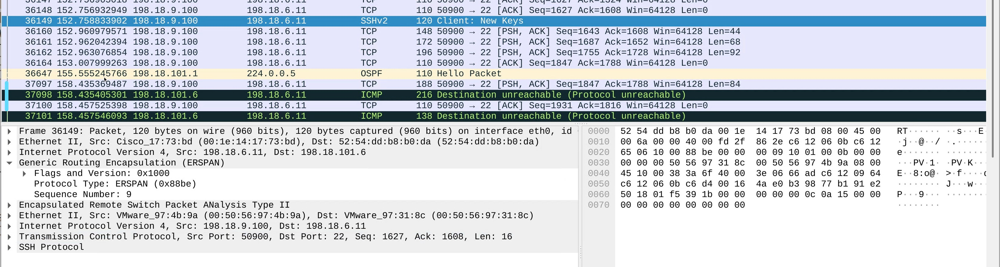

# Task 11: Wireshark Live Packet Capture (Web GUI + ERSPAN)

[⬅️ Back to Main Menu](../index.md)

## Table of Contents

- [Task Overview](#task-overview)
- [Step 1 – Connect to the Wireshark Container](#step-1-connect-to-the-wireshark-container)
- [Step 2 – Enable Packet Capture Permissions (One-Time Fix)](#step-2-enable-packet-capture-permissions-one-time-fix)
- [Step 3 – Restart the Wireshark Application](#step-3-restart-the-wireshark-application)
- [Step 4 – Configure ERSPAN on Cat8Kv-Task-1](#step-4-configure-erspan-on-cat8kv-task-1)
- [Step 5 – Access the Wireshark Web GUI](#step-5-access-the-wireshark-web-gui)
- [Step 6 – Start Packet Capture](#step-6-start-packet-capture)
- [Step 7 – Generate SSH Traffic](#step-7-generate-ssh-traffic)
- [Step 8 – Observe the Live Capture](#step-8-observe-the-live-capture)
- [What You Have Demonstrated](#what-you-have-demonstrated)

---

In this task, you will use **Wireshark running inside a container** to perform **live packet capture** from a remote router interface using **ERSPAN**.

This demonstrates how App-Hosting on Cisco edge devices can be used for **real-time traffic visibility** without deploying external probes.

---

## Task Overview

* Wireshark container is deployed on **Cat8Kv-Task-2**
* SSH traffic on **Cat8Kv-Task-1 (GigabitEthernet6)** is mirrored using **ERSPAN**
* Mirrored packets are sent to the Wireshark container
* Traffic is analyzed live using the **Wireshark Web GUI**

---

## Step 1 – Connect to the Wireshark Container

Login to **Cat8Kv-Task-2** and connect to the Wireshark container shell.

```bash
app-hosting connect appid wireshark session /bin/bash
```

You should now be inside the container.

---

## Step 2 – Enable Packet Capture Permissions (One-Time Fix)

Wireshark GUI uses a helper binary called **`dumpcap`** to capture packets.
By default, it does not have the required Linux capabilities inside the container.

Run the following commands **inside the container**:

```bash
sudo -i
```
```bash
which dumpcap
```
```bash
setcap cap_net_raw,cap_net_admin=eip /usr/bin/dumpcap
```
```bash
getcap /usr/bin/dumpcap
```

### Explanation

* `sudo -i` # Switches to root inside the container.

* `which dumpcap` # Confirms the location of the packet capture binary.

* `setcap cap_net_raw,cap_net_admin=eip /usr/bin/dumpcap` # Grants packet capture permissions without running Wireshark as root.

* `getcap /usr/bin/dumpcap` # Verifies that the permissions are applied correctly.

Expected output:

```bash
/usr/bin/dumpcap = cap_net_admin,cap_net_raw=eip
```

---

## Step 3 – Restart the Wireshark Application

Exit the wireshark container and restart the application so the new permissions take effect.

```bash
app-hosting stop appid wireshark
```
```bash
app-hosting start appid wireshark
```

---

## Step 4 – Configure ERSPAN on Cat8Kv-Task-1

On **Cat8Kv-Task-1**, configure ERSPAN to mirror **SSH traffic (TCP port 22)** from **GigabitEthernet6**.

### 4.1 Create an ACL to Match SSH Traffic

```bash
ip access-list extended 100
 10 permit tcp any any eq 22
```

---

### 4.2 Configure ERSPAN Source Session

```bash
monitor session 11 type erspan-source
 no shutdown
 source interface GigabitEthernet6
 filter access-group 100
 destination
  erspan-id 11
  mtu 1464
  ip address 198.18.101.6
  origin ip address 198.18.6.11
```
Verify ERSPAN Status
```bash
show monitor session all
```

### Explanation

* Traffic on **GigabitEthernet6** is monitored
* Only **SSH traffic** is mirrored (via ACL 100)
* Packets are encapsulated using **GRE (ERSPAN)**
* Destination is the **Wireshark container IP**

---

## Step 5 – Access the Wireshark Web GUI

From your workstation:

1. RDP into the Windows VM:

```bash
RDP 198.18.1.20
```

1. Open a browser and access:

```bash
https://198.18.101.6:3001
```

1. Launch **Wireshark** from the web desktop.

---

## Step 6 – Start Packet Capture

* Select the capture interface (typically `eth0`) and apply the following **display filter**:
* If copy paste doesn't work than type the below filter text

```text
(!(ip.src == 198.18.9.20)) && !(ip.dst == 198.18.9.20)
```

### Explanation

This filter removes RDP traffic generated by the Windows VM itself, keeping the capture focused on mirrored SSH traffic.

---

## Step 7 – Generate SSH Traffic

From the **Lab Ubuntu VM**, initiate an SSH session:

```bash
ssh admin@198.18.6.11
```

Login successfully to generate traffic.

---

## Step 8 – Observe the Live Capture

On the Wireshark GUI (RDP session):

* Observe packets arriving in real time
* Packets will appear **GRE-encapsulated** (ERSPAN)
* Inner packets will show **TCP port 22 (SSH)** traffic



This confirms successful **remote live packet capture** using ERSPAN.

---

## What You Have Demonstrated

- ✅ Wireshark running as a container on a Cisco edge device
- ✅ Secure, browser-based packet analysis
- ✅ ERSPAN-based traffic mirroring
- ✅ Live troubleshooting without external probes

This approach is ideal for **on-demand troubleshooting**, **remote operations**, and **lab environments** where deploying physical taps or SPAN ports is not feasible.

---

[⬅️ Return to Main Menu](../index.md)
