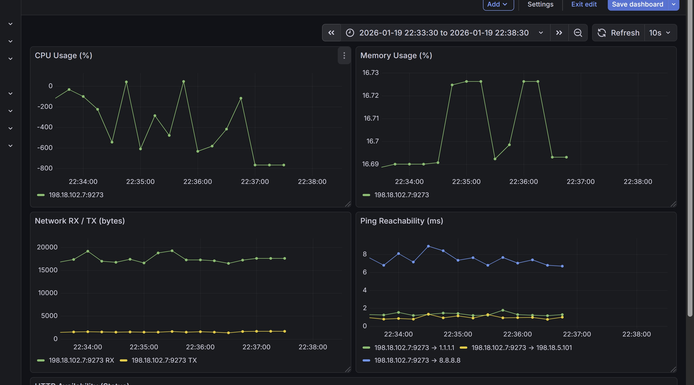
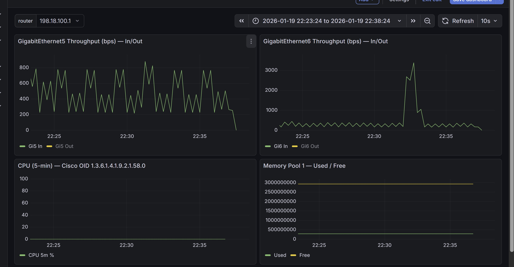

# Task 12: Telegraf Monitoring with Prometheus Exporter

[⬅️ Back to Main Menu](../index.md)

---

## Objective

In this task, you deploy and extend a **Telegraf-based monitoring probe** running inside the swiss-knife container to demonstrate how **modern telemetry pipelines** can be built on edge devices.

You will:

* Collect **container self-metrics** (CPU, memory, disk, network)
* Perform **ICMP reachability** and **HTTP/HTTPS availability** checks
* Expose metrics via a **Prometheus `/metrics` endpoint**
* Extend the same probe to collect **router metrics using SNMP**
* Visualize **both container and router metrics** centrally using **Prometheus and Grafana**

This task is divided into **two continuous parts** using the **same Telegraf container**.

---

### Part 1 – Container & Service Monitoring

* [Lab Architecture](#lab-architecture)
* [Step 1: Prepare Telegraf Configuration Directory](#step-1-prepare-telegraf-configuration-directory)
* [Step 2: Create Base Telegraf Agent Configuration](#step-2-create-base-telegraf-agent-configuration)
* [Step 3: Create Lab Configuration (Container, Ping, HTTP)](#step-3-create-lab-configuration-container-ping-http)
* [Step 4: Validate Telegraf Configuration](#step-4-validate-telegraf-configuration)
* [Step 5: Start Telegraf](#step-5-start-telegraf)
* [Step 6: Verify Metrics from Management Node](#step-6-verify-metrics-from-management-node)
* [Step 7: Visualize Container Metrics in Grafana](#step-7-visualize-container-metrics-in-grafana)

### Part 2 – Router Monitoring via SNMP

* [Step 8: Extend Telegraf with SNMP Monitoring](#step-8-extend-telegraf-with-snmp-monitoring)
* [Step 9: Validate SNMP Configuration](#step-9-validate-snmp-configuration)
* [Step 10: Verify SNMP Metrics Export](#step-10-verify-snmp-metrics-export)
* [Step 11: Visualize Router Metrics in Grafana](#step-11-visualize-router-metrics-in-grafana)
* [Lab Completion Criteria](#lab-completion-criteria)
* [Key Takeaway](#key-takeaway)
* [Summary](#summary)

---

## Lab Architecture

### Logical Components

* **Telegraf Container (Swiss-Knife)**
  * Collects container metrics
  * Executes ICMP and HTTP probes
  * Polls routers using SNMP
  * Exposes `/metrics` on port `9273`

* **Mgmt Ubuntu 1 Node**
  * Prometheus (scrapes metrics)
  * Grafana (visualization)

* **External Targets**
  * Public IPs (ICMP)
  * Public / internal HTTP services
  * IOS-XE routers (SNMP)

---

# Part 1 – Container & Service Monitoring

## Step 1: Prepare Telegraf Configuration Directory

Connect to the **Swiss-Knife container hosted on Cat8Kv-Task-2**:

```bash
ssh 198.18.1.12
app-hosting connect appid swiss_knife session /bin/bash
```

Create the Telegraf configuration directory:

```bash
mkdir -p /etc/telegraf/telegraf.d
```

---

## Step 2: Create Base Telegraf Agent Configuration

Create the global Telegraf agent configuration:

```bash
cat > /etc/telegraf/telegraf.conf <<'EOF'
[agent]
  interval = "10s"
  round_interval = true
  metric_batch_size = 1000
  metric_buffer_limit = 10000
  flush_interval = "10s"
EOF
```

This file defines **global agent behavior** only. All inputs and outputs are defined under `telegraf.d`.

---

## Step 3: Create Lab Configuration (Container, Ping, HTTP)

Edit the lab configuration file:

```bash
nano /etc/telegraf/telegraf.d/lab.conf
```

### `lab.conf`

```toml
[agent]
  interval = "10s"
  round_interval = true
  flush_interval = "10s"
  hostname = "swiss-knife-monitor"
  omit_hostname = false

###############################################################################
# A) Container Self-Monitoring
###############################################################################

[[inputs.cpu]]
  percpu = true
  totalcpu = true

[[inputs.mem]]

[[inputs.net]]

[[inputs.disk]]
  ignore_fs = ["tmpfs", "devtmpfs", "overlay"]

###############################################################################
# B) Network Reachability (ICMP)
###############################################################################

[[inputs.ping]]
  urls = [
    "8.8.8.8",
    "1.1.1.1",
    "198.18.5.101"
  ]
  count = 3
  timeout = 2.0
  method = "native"

###############################################################################
# C) HTTP / HTTPS Availability
###############################################################################

[[inputs.http_response]]
  urls = [
    "https://www.google.com",
    "https://www.cloudflare.com",
    "http://198.18.5.101:3000"
  ]
  response_timeout = "5s"
  follow_redirects = true

###############################################################################
# D) Output – Prometheus Exporter
###############################################################################

[[outputs.prometheus_client]]
  listen = ":9273"
  path = "/metrics"
```

---

## Step 4: Validate Telegraf Configuration

Validate the configuration before running Telegraf:

```bash
telegraf \
  --config /etc/telegraf/telegraf.conf \
  --config-directory /etc/telegraf/telegraf.d \
  --test | head
```
**Verify the following in the output:**

* ✅ **Both configs are loaded**

  ```
  Loading config: /etc/telegraf/telegraf.conf
  Loading config: /etc/telegraf/telegraf.d/lab.conf
  ```

* ✅ **Telegraf starts without errors**

  ```
  Starting Telegraf 1.x.x
  ```

* ✅ **Expected inputs are loaded**

  ```
  Loaded inputs: cpu disk http_response mem net ping
  ```

* ✅ **Host tag is present**

  ```
  Tags enabled: host=swiss-knife-monitor
  ```

* ✅ **Metrics are printed after the log lines**

  * You should see `mem`, `cpu`, `disk`, and `net` measurements with numeric values.

> ⚠️ A warning about `outputs not used in testing mode` is **expected** and can be ignored.

---

## Step 5: Start Telegraf

Start Telegraf in continuous mode:

```bash
telegraf \
  --config /etc/telegraf/telegraf.conf \
  --config-directory /etc/telegraf/telegraf.d
```

Metrics are now exposed at: `http://198.18.101.5:9273/metrics`

---

## Step 6: Verify Metrics from LAB Ubuntu Node

From the **LAB Ubuntu node**:

```bash
curl -s http://198.18.101.5:9273/metrics | head
```

**Verify the following:**

* ✅ Output starts with Prometheus metadata:

  ```
  # HELP cpu_usage_guest Telegraf collected metric
  # TYPE cpu_usage_guest gauge
  ```

* ✅ Metrics include the expected host label:

  ```
  host="swiss-knife-monitor"
  ```

* ✅ Numeric values are returned (not empty output)


Verify Prometheus targets:

```bash
curl http://198.18.5.101:9090/api/v1/targets
```
**Verify the following under `activeTargets`:**

* ✔️ Telegraf target shows **UP** status:

  ```json
  "job":"telegraf_containers",
  "instance":"198.18.101.5:9273",
  "health":"up",
  "lastError":""
  ```

---

## Step 7: Visualize Container Metrics in Grafana

1. Open Grafana:

```text
http://198.18.1.101:3000
```
The above link can be opned directly from the LAB PC

Login: `admin / C1sco12345`

1. Navigate to:

```text
Dashboards → Swiss-Knife Telegraf Lab
```

### Expected Observations

* Container CPU and memory graphs update in real time
* Network RX/TX traffic is visible
* Ping and HTTP checks reflect reachability and availability
* Change time range to 5 min and give a few min for graphs to get populated


---

# Part 2 – Router Monitoring via SNMP

## Step 8: Extend Telegraf with SNMP Monitoring

Stop the telegraf process and edit the existing lab configuration:

```bash
nano /etc/telegraf/telegraf.d/lab.conf
```

Append the below SNMP configuration at the end of the file  
This will poll CPU, Interface and Memory for all 3 Cat8Kv routers


```toml
###############################################################################
# SNMP Monitoring – Cat8Kv-Task-1
###############################################################################

[[inputs.snmp]]
  agents = [ "udp://198.18.6.11:161" ]
  version = 2
  community = "public"
  interval = "30s"
  timeout = "5s"
  retries = 2

  name = "snmp"
  agent_host_tag = "agent_host"

  # GigabitEthernet5 (ifIndex 2)
  [[inputs.snmp.field]]
    name = "ifInOctets_gi5"
    oid  = "1.3.6.1.2.1.2.2.1.10.2"

  [[inputs.snmp.field]]
    name = "ifOutOctets_gi5"
    oid  = "1.3.6.1.2.1.2.2.1.16.2"

  # GigabitEthernet6 (ifIndex 3)
  [[inputs.snmp.field]]
    name = "ifInOctets_gi6"
    oid  = "1.3.6.1.2.1.2.2.1.10.3"

  [[inputs.snmp.field]]
    name = "ifOutOctets_gi6"
    oid  = "1.3.6.1.2.1.2.2.1.16.3"

  # CPU – 5 minute average
  [[inputs.snmp.field]]
    name = "cpu_5min"
    oid  = "1.3.6.1.4.1.9.2.1.58.0"

  # Memory Pool 1
  [[inputs.snmp.field]]
    name = "mem_pool1_used"
    oid  = "1.3.6.1.4.1.9.9.48.1.1.1.5.1"

  [[inputs.snmp.field]]
    name = "mem_pool1_free"
    oid  = "1.3.6.1.4.1.9.9.48.1.1.1.6.1"

###############################################################################
# SNMP Monitoring – Cat8Kv-Task-2
###############################################################################

[[inputs.snmp]]
  agents = [ "udp://198.18.7.12:161" ]
  version = 2
  community = "public"
  interval = "30s"
  timeout = "5s"
  retries = 2

  name = "snmp"
  agent_host_tag = "agent_host"

  # GigabitEthernet5 (ifIndex 2)
  [[inputs.snmp.field]]
    name = "ifInOctets_gi5"
    oid  = "1.3.6.1.2.1.2.2.1.10.2"

  [[inputs.snmp.field]]
    name = "ifOutOctets_gi5"
    oid  = "1.3.6.1.2.1.2.2.1.16.2"

  # GigabitEthernet6 (ifIndex 3)
  [[inputs.snmp.field]]
    name = "ifInOctets_gi6"
    oid  = "1.3.6.1.2.1.2.2.1.10.3"

  [[inputs.snmp.field]]
    name = "ifOutOctets_gi6"
    oid  = "1.3.6.1.2.1.2.2.1.16.3"

  # CPU – 5 minute average
  [[inputs.snmp.field]]
    name = "cpu_5min"
    oid  = "1.3.6.1.4.1.9.2.1.58.0"

  # Memory Pool 1
  [[inputs.snmp.field]]
    name = "mem_pool1_used"
    oid  = "1.3.6.1.4.1.9.9.48.1.1.1.5.1"

  [[inputs.snmp.field]]
    name = "mem_pool1_free"
    oid  = "1.3.6.1.4.1.9.9.48.1.1.1.6.1"

###############################################################################
# SNMP Monitoring – Cat8Kv-Task-3
###############################################################################

[[inputs.snmp]]
  agents = [ "udp://198.18.8.13:161" ]
  version = 2
  community = "public"
  interval = "30s"
  timeout = "5s"
  retries = 2

  name = "snmp"
  agent_host_tag = "agent_host"

  # GigabitEthernet5 (ifIndex 2)
  [[inputs.snmp.field]]
    name = "ifInOctets_gi5"
    oid  = "1.3.6.1.2.1.2.2.1.10.2"

  [[inputs.snmp.field]]
    name = "ifOutOctets_gi5"
    oid  = "1.3.6.1.2.1.2.2.1.16.2"

  # GigabitEthernet6 (ifIndex 3)
  [[inputs.snmp.field]]
    name = "ifInOctets_gi6"
    oid  = "1.3.6.1.2.1.2.2.1.10.3"

  [[inputs.snmp.field]]
    name = "ifOutOctets_gi6"
    oid  = "1.3.6.1.2.1.2.2.1.16.3"

  # CPU – 5 minute average
  [[inputs.snmp.field]]
    name = "cpu_5min"
    oid  = "1.3.6.1.4.1.9.2.1.58.0"

  # Memory Pool 1
  [[inputs.snmp.field]]
    name = "mem_pool1_used"
    oid  = "1.3.6.1.4.1.9.9.48.1.1.1.5.1"

  [[inputs.snmp.field]]
    name = "mem_pool1_free"
    oid  = "1.3.6.1.4.1.9.9.48.1.1.1.6.1"
```
---

## Step 9: Validate SNMP Configuration

Test SNMP polling:

```bash
telegraf \
  --config /etc/telegraf/telegraf.conf \
  --config-directory /etc/telegraf/telegraf.d \
  --test | grep snmp
```
### Expected Output

Metrics such as:

* `snmp_ifInOctets_gi5`
* `snmp_ifOutOctets_gi6`
* `snmp_cpu_5min`
* `snmp_mem_pool1_used`

Start Telegraf in continuous mode:

```bash
telegraf \
  --config /etc/telegraf/telegraf.conf \
  --config-directory /etc/telegraf/telegraf.d
```
---

## Step 10: Verify SNMP Metrics Export

From the LAB Ubuntu node:

```bash
curl -s http://198.18.101.5:9273/metrics | grep snmp | head
```

Verify Prometheus ingestion:

```bash
curl http://198.18.5.101:9090/api/v1/series -d 'match[]=snmp_cpu_5min'
```

---

## Step 11: Visualize Router Metrics in Grafana

1. Open Grafana
1. Navigate to:

```text
Dashboards → Cat8Kv SNMP via Telegraf
```

1. Select router from the **router dropdown** (e.g. `198.18.6.11`)

### Expected Results

* Gi5 / Gi6 throughput graphs populate
* CPU (5-minute average) updates
* Memory used/free graphs update



---

## Lab Completion Criteria

You have successfully completed this lab when:

* Telegraf exports container and SNMP metrics
* Prometheus ingests all metrics
* Grafana visualizes container and router telemetry
* Router metrics correlate with legacy MRTG behavior

---

## Key Takeaways

This task demonstrates how **traditional monitoring (SNMP/MRTG)** and **modern telemetry** can coexist by:

* Using a containerized probe at the edge
* Exporting metrics via Prometheus
* Visualizing correlated infrastructure and application health

---

This forms the foundation for scalable, vendor-neutral observability on edge platforms.

---

[⬅️ Return to Main Menu](../index.md)
